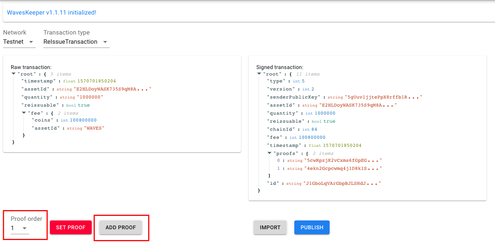

# WAVES TX CREATOR

## Steps
- Install WaveeKeeper plugin on your browser, create an account
- Launch the [website](https://waves-tx-creator.herokuapp.com/)
- WavesKeeper will ask if you allow website to access it 

- Choose `Auth` 

- Make sure you have the blue message below. Then choose a Transaction type (eg `ReIssue Transaction`)

- Make changes to the transaction data as you like. If you're unsure which parameters to change, read the Waves documentation first 

- Sign the transaction: choose a `Proof Order` (if your AssetScript requires multisig), or leave it 0, then click `SET PROOF`
- WavesKeeper will ask for your confirmation, check the transaction detail and click `Sign` in the lower right 

- Your transaction is signed, now hit `Close` button 

- The signed transaction data will appear on the right side. You can choose to `PUBLISH`, or copy the data then pass on to others for signing 

- Confirm to broadcast transaction, when broadcasted the transaction is **irreversible**:

- Wait for the broadcast to finish, you will get message with link to transaction for review

- In case you want to pass the signed transaction data around for multi-signing, copy it then send to your colleague using whateve means you find safe. Then your colleague should use the `IMPORT` function

- Paste the content in the textbox, then choose `IMPORT`

- Now choose a different `Proof Order` and `ADD PROOF`, complete the signing in WavesKeeper

- Repeat the steps until you reach your minimum requirement for multisig, then `PUBLISH` the transaction